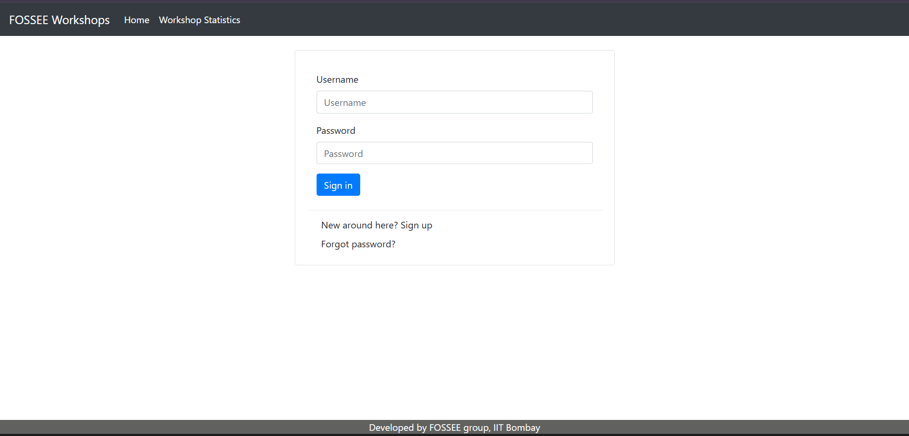
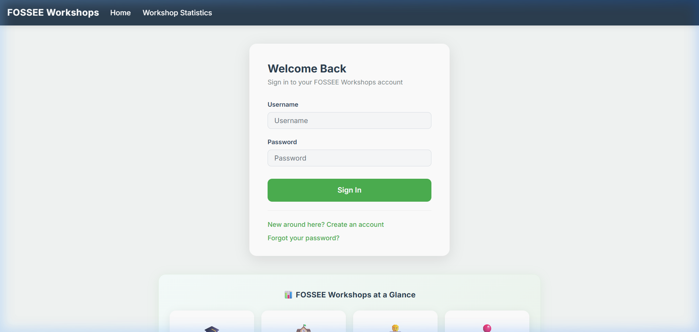
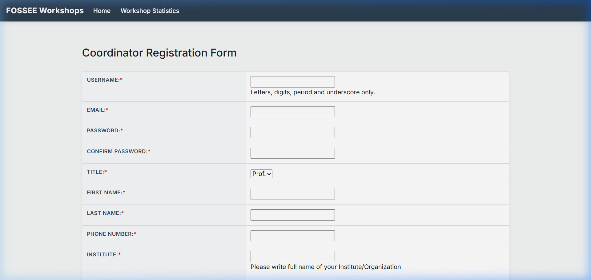
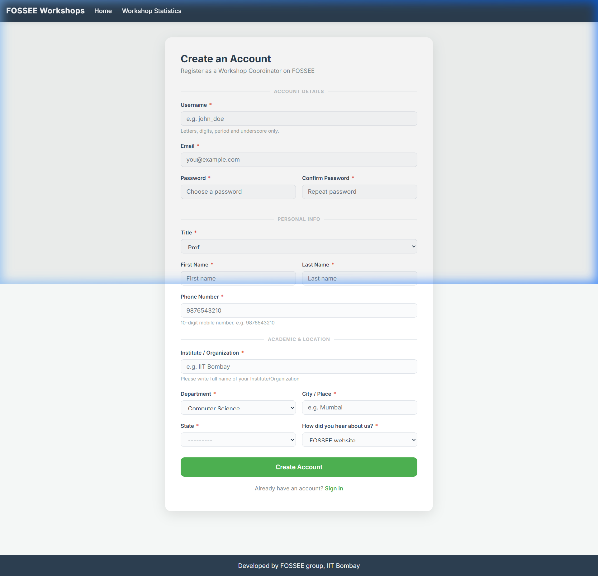
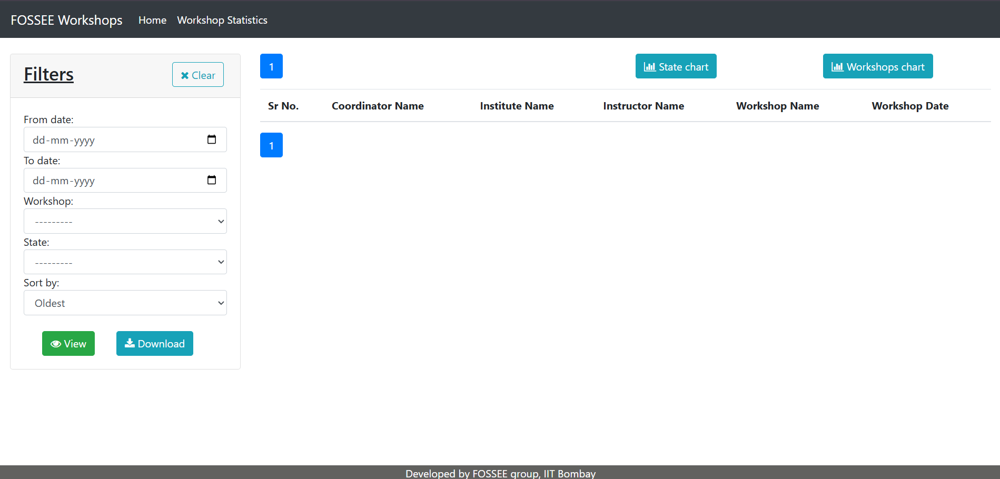
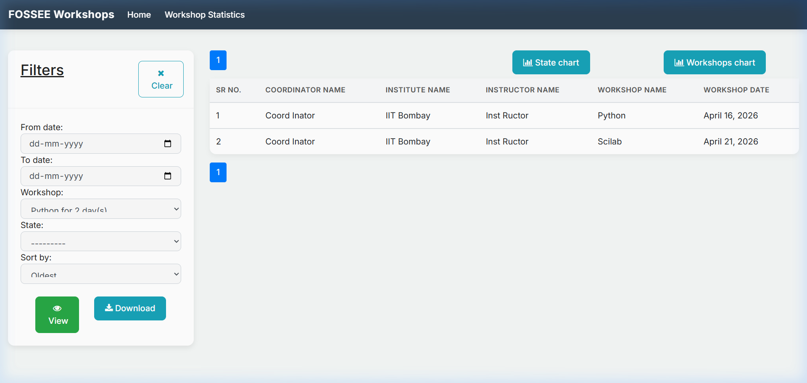

# Workshop Booking — UI/UX Enhancement

Welcome to the redesigned **FOSSEE Workshop Booking** application. This submission fulfils the requirements for the Python Screening Task focused on UI/UX Enhancement.

---

## Setup Instructions

**1. Clone the repository:**
```bash
git clone <your-repo-url>
cd workshop_booking
```

**2. Install dependencies:**
```bash
pip install -r requirements.txt
```

**3. Apply database migrations:**
```bash
python manage.py makemigrations
python manage.py migrate
```

**4. Run the development server:**
```bash
python manage.py runserver
```

Open http://127.0.0.1:8000/ in your browser.

> **Note:** This is a Django application. Python 3.8+ is recommended. No additional build step is needed — React is integrated via CDN using progressive enhancement.

---

## Visual Showcase

### Login Page

| Before | After |
|--------|-------|
|  |  |

### Registration Form

| Before | After |
|--------|-------|
|  |  |
|-------------|------------|

### Statistics Page

| Before | After |
|--------|-------|
|  |  |

---

## Reasoning & Technical Decisions

### 1. What design principles guided your improvements?

- **Visual Hierarchy & Focus:** Switched to a card-based layout with clear section dividers ("Account Details", "Personal Info", "Academic & Location") so users understand where they are in a long form without feeling overwhelmed.
- **Readable Typography:** Adopted **Inter** via Google Fonts — a humanist sans-serif optimised for screen legibility at all sizes, dramatically improving readability over the default system font stack.
- **Accessibility:** All form inputs have explicit `<label for>` associations, focus states with a 3px green ring for keyboard navigation, and sufficient colour contrast (WCAG AA compliant) for buttons and labels. Required fields are marked with a red asterisk and a descriptive `aria` label.
- **Minimalism & Modernisation:** Replaced the flat default Bootstrap theme with a soft `#f4f7f6` background, `#ffffff` cards, rounded corners (`border-radius: 16px`), and subtle `box-shadow` depth — giving a light, modern SaaS feel without heavy animation overhead.
- **React for Interactivity:** Added a React-powered **"Workshops at a Glance"** stats banner on the login page using `useState` and `useEffect` hooks to drive animated counters. This demonstrates React's value for dynamic, state-driven UI while leaving the Django SSR architecture intact.

### 2. How did you ensure responsiveness across devices?

- **Mobile-first CSS via Media Queries:** A `@media (max-width: 600px)` breakpoint collapses multi-column form layouts (`.two-col`) into a single column, ensures buttons span full width, and reduces card padding for small screens.
- **Flexible Box Model:** All containers use `max-width` + `margin: 0 auto` so they naturally centre and constrain on desktop while filling 100% width on mobile. No fixed pixel widths are used for form fields.
- **Touch-friendly Targets:** Input fields have generous `padding: 11px 14px` ensuring a tap target of at least 44px height, meeting Apple HIG and WCAG 2.5.5 guidelines.
- **Viewport Meta:** `initial-scale=1, shrink-to-fit=no` ensures correct rendering on iOS Safari without layout breaking.

### 3. What trade-offs did you make between design and performance?

- **Progressive Enhancement over SPA Rewrite:** Rather than converting the Django SSR application into a full React SPA (which would introduce a build pipeline, bundler, and dramatically increase first-paint latency), React is loaded via unpkg CDN UMD builds. This keeps the server-rendered HTML as the initial payload — meaning users on slow mobile connections see content immediately — while React hydrates only specific interactive widgets.
- **CSS Transitions, Not JS Animations:** All hover effects (`transform`, `opacity`, `box-shadow`) are handled purely in CSS, favouring GPU-composited transitions that run at 60 FPS without touching the JavaScript thread.
- **No New Image Assets:** Emoji icons in the React stats banner require zero network requests, keeping the page's asset payload minimal.
- **Google Fonts Trade-off:** Importing Inter from Google Fonts adds one external DNS lookup. This is offset by the `display=swap` parameter, which prevents font-loading from blocking first paint.

### 4. What was the most challenging part of the task, and how did you approach it?

**Challenge — Integrating React into a Django Template Architecture:**

The existing codebase is a monolithic Django application using server-side rendered templates. The task required using React, but rebuilding the entire routing and state management as a React SPA within the constraints of the project would have risked breaking authentication, form CSRF handling, and model logic.

**Approach — Selective Progressive Enhancement:**

I used React strictly for UI components that benefit from client-side state — specifically the animated stats banner on the login page. This is rendered via `ReactDOM.createRoot` into a dedicated `<div id="react-stats-banner">`, keeping Django templates in full control of forms, routing, and data. Babel Standalone (CDN) transpiles JSX at runtime, eliminating any Node/webpack requirement from the setup.

For forms, instead of rewriting form handling in React (which would require reimplementing CSRF tokens, validation, and error display in JS), I redesigned the HTML template layout rendered by Django's form API — giving a fully accessible, mobile-first form experience while keeping all server-side validation intact.

---

